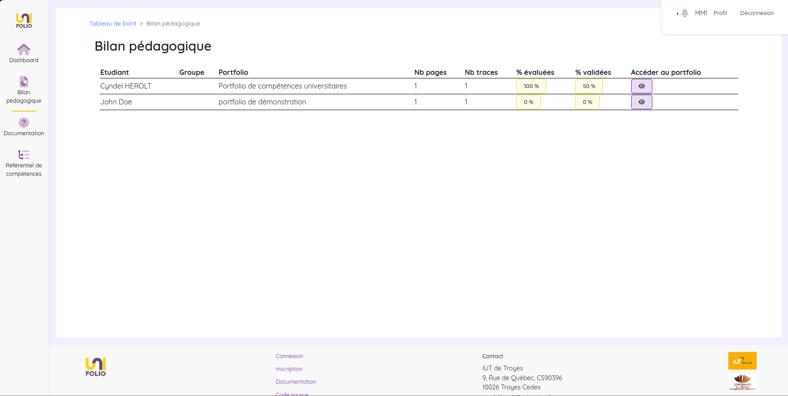
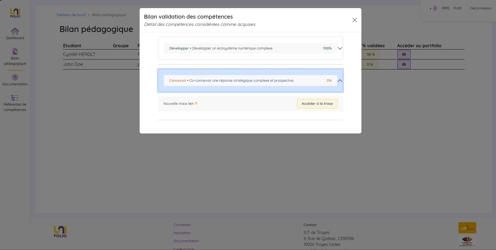

# Bilan pédagogique



<figure><figcaption>
Processus de compréhension et d'utilisation du bilan pédagogique
</figcaption></figure>



Le Bilan Pédagogique permet d'avoir une vue d'ensemble de l'état des travaux des étudiants d'un département. Vous y trouvez notamment les détails des portfolios (nombre de pages, de traces etc) mais aussi des statistiques liés à l'évaluation (le pourcentage de compétences évaluées et/ou considérées comme validées). C'est également un point d'accès aux échantillons à évaluer.

<figure><figcaption>
Aperçu de la page de bilan d'évaluation
</figcaption></figure>

Si vous cliquez sur l'un des pourcentage, vous pouvez en voir le détail et accéder aux traces qui contiennent chacune des compétences. Vous pouvez également directement accéder au portfolio complet en cliquant sur le dernier bouton de la ligne.

<figure><figcaption>
Aperçu du détail pour les compétences considérées comme acquises
</figcaption></figure>


