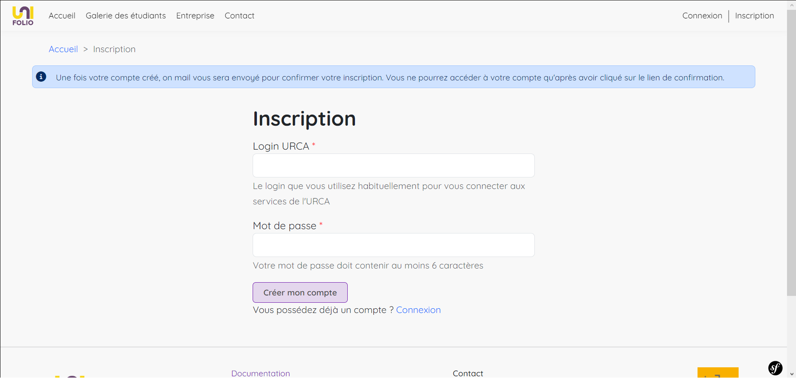

# 📝 Inscription



<figure><figcaption>
Processus d'inscription
</figcaption></figure>



Lors de votre première visite sur UniFolio, vous allez trouver en haut à droite de votre écran le bouton Inscription. Il vous mène sur cette page.

<figure><figcaption>
Formulaire d'inscription
</figcaption></figure>

Comme indiqué, saisissez votre [login URCA](#user-content-fn-1)[^1] ainsi qu'un mot de passe de votre choix.

La création de votre compte déclenche l'envoi d'un mail sur votre adresse mail universitaire. Trouvez ce mail et cliquez sur le lien en question. Si vous ne le trouvez pas, vérifiez vos spams et seulement après cette vérification, si vous n'avez toujours pas reçu le mail ; vous pouvez en demander un nouveau depuis la page Connexion.

Si jamais après ces étapes, vous ne recevez pas le mail de vérification, adressez-vous à l'administrateur du site

Le lien vous redirige alors vers la page de [connexion,](enseignant/premiere-connexion.md) sur laquelle vous pouvez utiliser votre login URCA et votre mot de passe afin d'accéder à votre compte.


Afin de créer et alimenter votre espace, UniFolio récupère directement vos données depuis l'Intranet lorsque vous validez votre compte à l'aide du lien envoyé par mail. Vous pouvez les consulter depuis la page profil et accéder au détail du traitement de vos données personnelles [ici](https://localhost:8000/rgpd).




[^1]: Le login URCA est l'identifiant fourni par l'IUT qui vous permet de de vous connecter aux services de l'URCA (bureau virtuel, intranet).
