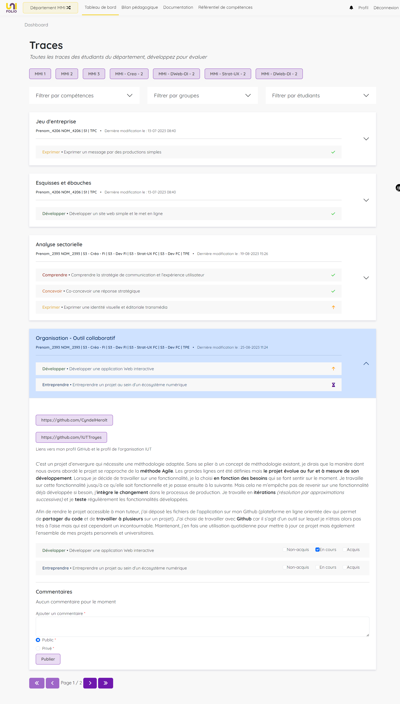

# 🧑🏫 Enseignant

### Première connexion

Votre première connexion vous mènera à un page spécifique sur laquelle vous allez devoir définir quel sera **votre département par défaut**. Si vous enseignez dans plusieurs départements, ce choix n'engage à rien puisque vous pourrez bien entendu en changer par la suite.

<figure><figcaption>
page de choix du département
</figcaption></figure>

### Tableau de bord

Le Dashboard rassemble l'ensemble des travaux des étudiants de votre département et constitue votre point d'entrée pour les évaluer.

#### Evaluation des traces

Le système d'évaluation des traces est simple. Quand l'étudiant créé une trace, il y indique quelle.s compétence.s elle est sensé confirmer. \
De votre côté, quand vous la visualisez, il vous suffit de cocher l'une des trois propositions d'évaluation : **non acquis, en cours d'acquisition, acquis** et vous pouvez faire un retour écrit à l'étudiant grace au système de **commentaire**.

Dans un premier temps, vous allez trouver la section d'évaluation des traces. Elles rassemble l'ensemble des traces créées par les étudiants de votre département mais vous pouvez filtrer les resultats par année, par compétences, par groupe et par étudiants (les filtres sont cumulables). Les resultats sont un condensé des informations essentielles pour se repérer : le titre, l'étudiant, la date de dernière modification et les compétences couvertes avec leur état d'évaluation (⌛ en attente d'évaluation, ❌ non acquis, ⬆ en cours d'acquisition, ✅ acquis).

Dès lors que vous avez trouvé la trace que vous souhaitez évaluer, il vous suffit de dérouler la petite carte qui la compose afin d'accéder à son contenu.&#x20;

<figure><figcaption>
dashboard, section évaluation des traces
</figcaption></figure>

