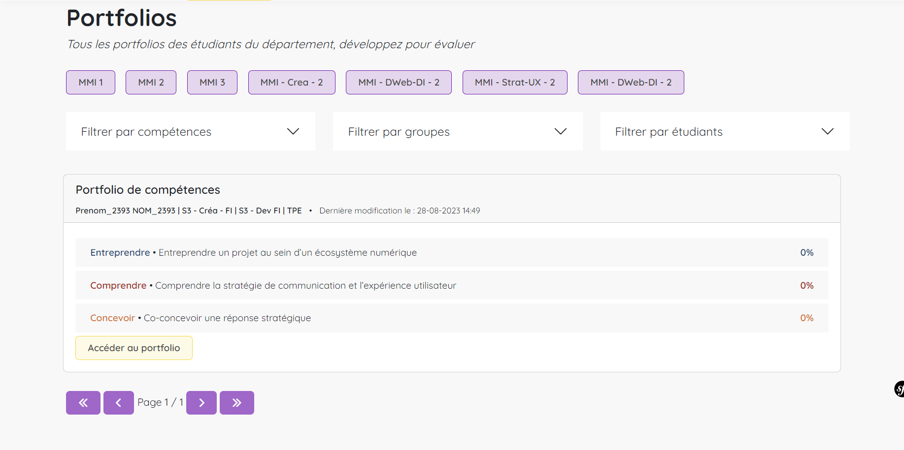
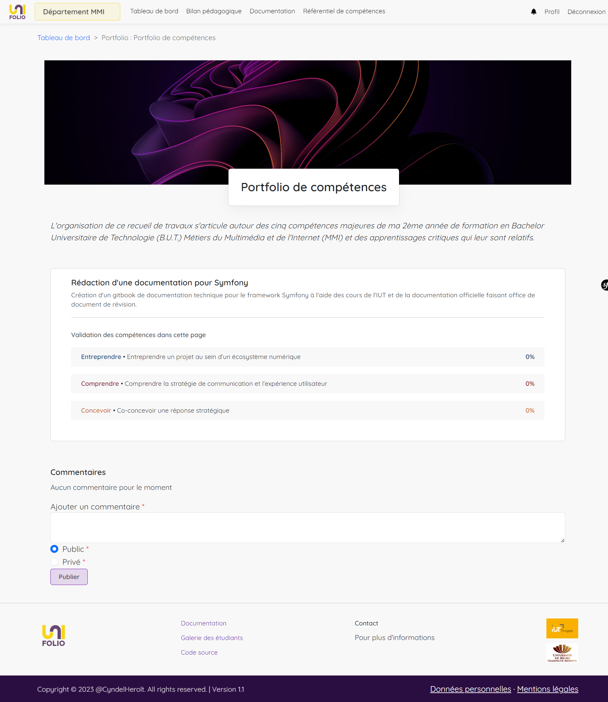

# 🧑🏫 Enseignant

### Première connexion

Votre première connexion vous mènera à une page spécifique sur laquelle vous allez devoir définir quel sera **votre département par défaut**. Si vous enseignez dans plusieurs départements, ce choix n'engage à rien puisque vous pourrez bien entendu en changer par la suite.

<figure><figcaption>
page de choix du département
</figcaption></figure>

C'est grace à ce bouton qui se trouve dans le menu que vous pouvez à tout moment changer de département.

<figure><figcaption>
bouton de changement de département
</figcaption></figure>

### Tableau de bord

Le Dashboard rassemble l'ensemble des travaux des étudiants de votre département et constitue votre point d'entrée pour les évaluer.

#### Evaluation des traces

Dans un premier temps, vous allez trouver la section d'évaluation des traces. \
Elle rassemble l'ensemble des traces créées par les étudiants de votre département mais vous pouvez filtrer les resultats par années, par compétences, par groupes et par étudiants (les filtres sont cumulables). \
Les resultats sont un condensé des informations essentielles pour se repérer : le titre, l'étudiant, la date de dernière modification et les compétences couvertes avec leur état d'évaluation (⌛ en attente d'évaluation, ❌ non acquis, ⬆ en cours d'acquisition, ✅ acquis).

Le système d'évaluation des traces est simple. Quand l'étudiant créé une trace, il y indique quelle.s compétence.s elle est sensé confirmer. \
De votre côté, quand vous la visualisez, il vous suffit de cocher l'une des trois propositions d'évaluation : **non acquis, en cours d'acquisition, acquis** et vous pouvez faire un retour écrit à l'étudiant grace au système de **commentaire**.

Dès lors que vous avez trouvé la trace que vous souhaitez évaluer, il vous suffit de **dérouler la petite carte** qui la compose afin d'accéder à son contenu détaillé. A la suite du contenu, vous pouvez évaluer les compétences et laisser un ou plusieurs commentaires.

Vous avez la possibilité de laisser des **commentaires publics et privés**.\
Les commentaires publics seront visibles aussi bien de l'étudiant que des autres enseignants du département alors que les commentaires privés vous permettent d'échanger entre enseignants.


Les étudiants ne peuvent pas vous répondre ou commenter leurs propres travaux.


<figure><figcaption>
dashboard, section évaluation des traces
</figcaption></figure>

#### Evaluation des portfolios

Toujours sur votre dashboard, vous allez trouver la section d'évaluation des portfolios. Le principe est sensiblement le même que pour les traces ; l'ensemble des portfolios des étudiants du département sont affichés, il suffit de filtrer pour amoindrir le nombre de resultats.&#x20;

Pour chaque portfolio sont affichées les compétences couvertes par l'étudiant ainsi que leur pourcentage de validation **(qui ne prend en compte que les compétences marquées comme acquises).** Cliquez sur "Accéder au portfolio" afin d'en visualiser et évaluer le contenu.

<figure><figcaption>
dashboard, section évaluation des portfolios
</figcaption></figure>

Sur la page de visualisation du portfolio sont regroupées les pages qui le composent _(sur l'exemple il n'y en a qu'une mais il pourrait très bien en avoir plusieurs)_, le pourcentage de validation des compétences pour chacune d'entre elle ainsi qu'un formulaire permettant de laisser un commentaire. **Ce commentaire fait office de bilan général du portfolio.**&#x20;

Cliquez sur une page pour accéder à son contenu. Vous pouvez alors évaluer chaque trace de la même manière qu'il est possible de le faire individuellement depuis le dashboard.

<figure><figcaption>
affichage du portfolio
</figcaption></figure>

Ces deux procédés vous permettent d'orienter votre évaluation soit trace par trace, soit portfolio par portfolio selon vos besoins.
