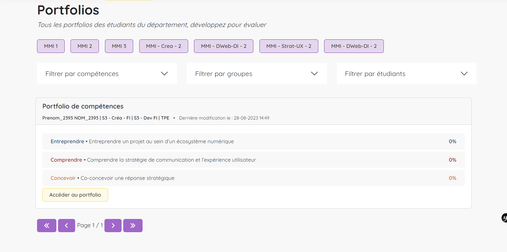
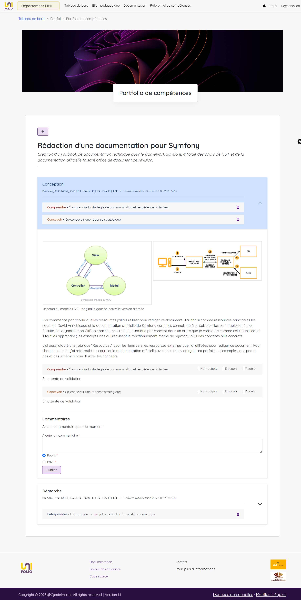

# Evaluation des portfolios

Toujours sur votre dashboard, vous allez trouver la section d'évaluation des portfolios. Le principe est sensiblement le même que pour les traces ; l'ensemble des portfolios des étudiants du département sont affichés, il suffit de filtrer pour amoindrir le nombre de resultats.&#x20;

Pour chaque portfolio sont affichées les compétences couvertes par l'étudiant ainsi que leur pourcentage de validation **(qui ne prend en compte que les compétences marquées comme acquises).** Cliquez sur "Accéder au portfolio" afin d'en visualiser et évaluer le contenu.

<figure><figcaption>
dashboard, section évaluation des portfolios
</figcaption></figure>

Sur la page de visualisation du portfolio sont regroupées les pages qui le composent _(sur l'exemple il n'y en a qu'une mais il pourrait très bien en avoir plusieurs)_, le pourcentage de validation des compétences pour chacune d'entre elle ainsi qu'un formulaire permettant de laisser un commentaire. **Ce commentaire fait office de bilan général du portfolio.**&#x20;

<figure><figcaption>
affichage du portfolio
</figcaption></figure>

Cliquez sur une page pour accéder à son contenu. Vous pouvez alors évaluer chaque trace de la même manière qu'il est possible de le faire individuellement depuis le dashboard.

<figure><figcaption>
visualisation d'une trace dans sa page
</figcaption></figure>
