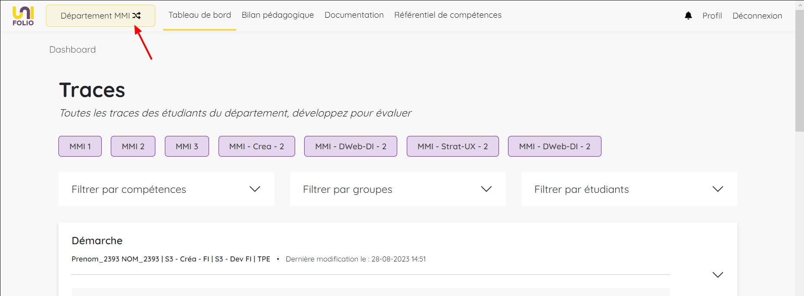

# Première connexion



<figure><figcaption>
Processus de connexion
</figcaption></figure>



Saisissez votre login URCA et votre mot de passe puis connectez vous.

Votre première connexion vous mènera à une page spécifique sur laquelle vous allez devoir définir quel sera **votre département par défaut**. Si vous enseignez dans plusieurs départements, ce choix n'engage à rien puisque vous pourrez en changer par la suite.

<figure><figcaption>
Aperçu de la page de choix du département par défaut
</figcaption></figure>

Une fois connecté, c'est grace à ce bouton qui se trouve dans le menu que vous pouvez à tout moment changer de département.

<figure><figcaption>
Bouton de changement de département par défaut
</figcaption></figure>



