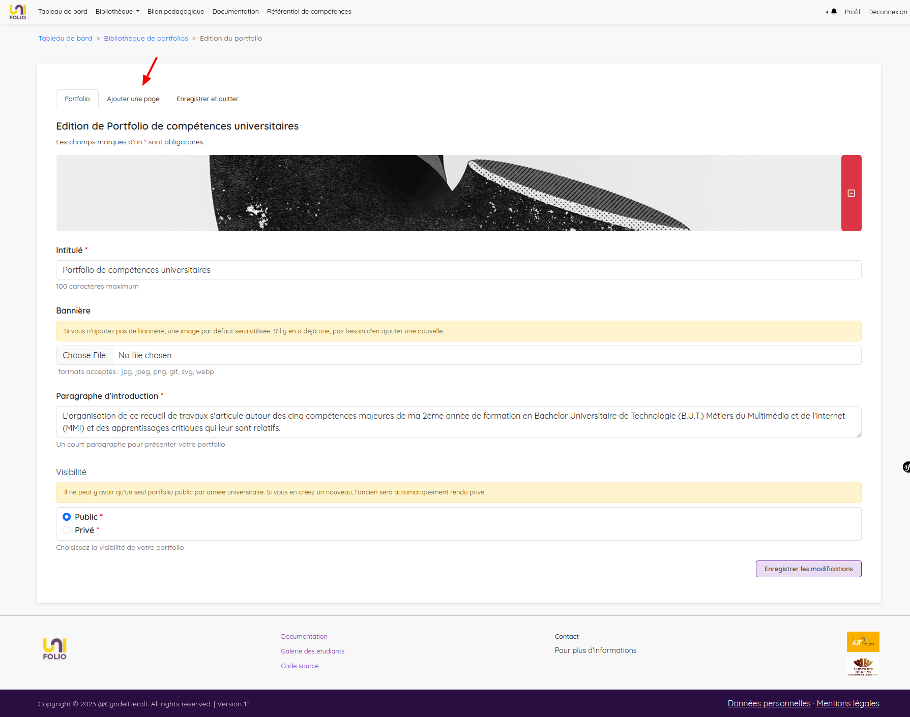
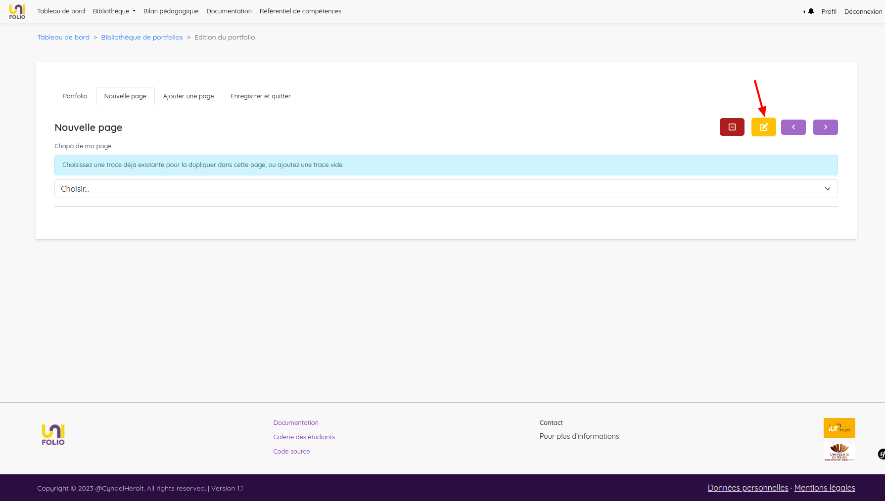
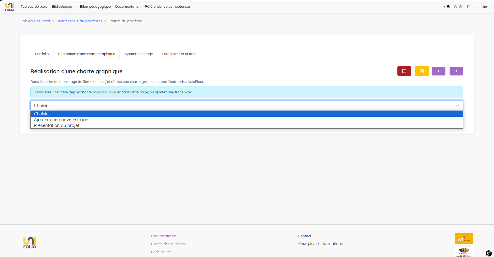

# Création d'un portfolio



<figure><figcaption>
Processus de création d'un nouveau portfolio
</figcaption></figure>



<figure><figcaption></figcaption></figure>

<figure><figcaption></figcaption></figure>

<figure><figcaption></figcaption></figure>


