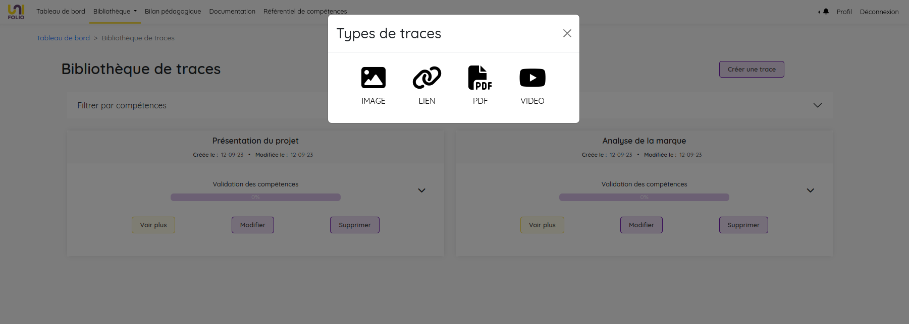

# Création d'une trace

Pour chaque trace, vous devrez insérer un ou plusieurs médias **de même type** (image, lien, pdf ou vidéo) qui permettront d'illustrer les arguments que vous développez dans cette trace.&#x20;

Les types de traces :&#x20;

1. **Image** => 2mo maximum - formats acceptés : _jpg, jpeg, png, gif, svg, webp_.
2. **Liens** => Ils doivent être saisis sous ce format : _https://www.exemple.com_. Evitez les liens à rallonge, privilégiez par exemple les liens formatés pour le partage.
3. **Pdf** => 8mo maximum - format accepté : _pdf_.
4. **Vidéo** => Source acceptée : _YouTube. Ces deux types de liens sont acceptés :_ \
   _https://youtu.be/fKKNPLowteY?si=JE64BcZOSc\_7FQ1j_ \
   _https://www.youtube.com/embed/fKKNPLowteY?si=xi8xjBqDADvKZ3kt_


**Si vos images font plus de 2mo** et que vous ne savez pas comment réduire leur poids, vous pouvez utiliser un compresseur d'image en ligne ou bien des logiciels de compression d'images tels que Imagine ou E-Mage.

**Si vos pdf font plus de 8mo** et que vous ne savez pas comment réduire leur poids, vérifier que son contenu est optimisé (par ex. si il contient des images, elles doivent être compressées), utilisez un compresseur de pdf en ligne, le logiciel AdobeAcrobat ou déposez votre pdf sur un drive et partagez le lien plutôt que le fichier.




<figure><figcaption>
Processus de création d'une trace
</figcaption></figure>



Depuis votre dashboard ou votre bibliothèque de traces, cliquez sur **"Créer une trace"**, un pop-up vous sollicite alors pour choisir le **type de trace** que vous souhaitez créer.

<figure><figcaption>
Aperçu de l'interface de création de traces - Choix du type
</figcaption></figure>

Quelque soit le type de trace que vous choisissez, le formulaire de création est sensiblement le même. Un éditeur de texte est intégré au champ Commentaire. C'est dans ce champ que vous allez **construire votre argumentaire autour de votre média**. Il propose un certain nombre d'options de mise en forme pour vous permettre de structure votre propos. \
Malgré tout, une trace doit rester succinte et non se dérouler sur des centaines de lignes. Faites **court et pertinent**.

<figure><figcaption></figcaption></figure>


